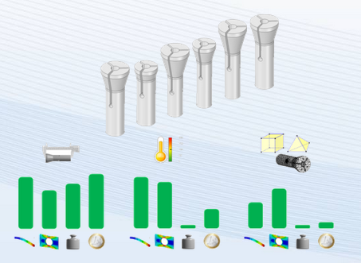
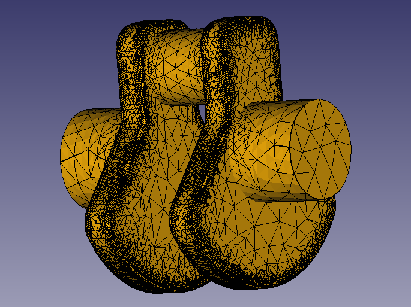

# Differential Self-Driving Robot (BumperBot)
[![LinkedIn][linkedin-shield]][linkedin-url]

<div align="center">
  
  
</div>

# FreeCAD Genetic Algorithm FEA

This repository contains scripts and utilities to run parametric and genetic algorithm-based finite element analysis (FEA) using FreeCAD. The project is designed to automate the exploration of optimized designs by sweeping parameter values or employing a genetic algorithm to minimize von Mises stress.

## Features

- **Parametric FEA**: Automate parameter sweeps to run FEA on multiple design configurations and analyze the results.
- **Genetic Algorithm**: Leverage a genetic algorithm to optimize designs based on von Mises stress results.
- **FreeCAD Integration**: Scripts dynamically interact with FreeCAD, utilizing its Python API for CAD model manipulation and FEA.
- **CSV Output**: Results are saved in CSV format, including von Mises stress and the corresponding parameters for easy post-analysis.
- **Logging**: Comprehensive logging to help monitor progress and debug issues.

## Requirements

- Python 3.8+
- FreeCAD 0.21+
  
The project uses Poetry and Pipenv for dependency management. You can choose either to manage the dependencies.

## Setup with Poetry

1. Install [Poetry](https://python-poetry.org/docs/):
   ```bash
   curl -sSL https://install.python-poetry.org | python3 -
